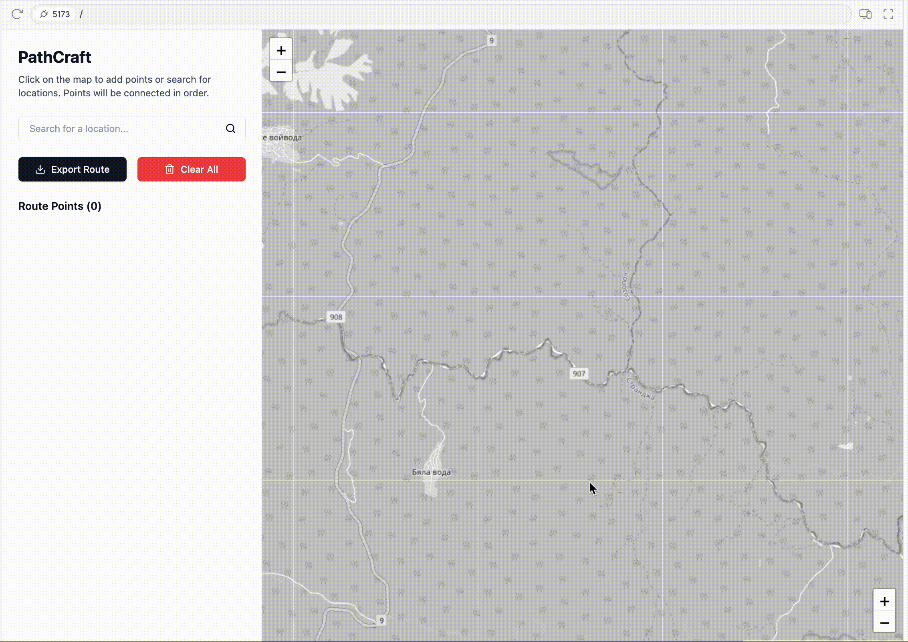

# PathCraft
[](https://github.com/petemihaylov/path-craft/actions/workflows/build.yml)

An interactive map tool for drawing and exporting routes. Built with React, Leaflet, and Tailwind CSS.



## Features

- 🗺️ Interactive map with grayscale styling
- 📍 Click to add route points
- 🔍 Search for locations
- 📋 Copy coordinates with one click
- 🔄 Export route points in TypeScript format

## Getting Started

Clone the repo:
```bash
   git clone https://github.com/petemihaylov/path-craft.git
```

```bash
# Install dependencies
npm install
```

```bash
# Start development server
npm run dev
```

```bash
# Build for production
npm run build
```

## License

[MIT](https://github.com/petemihaylov/path-craft/blob/master/LICENSE)
